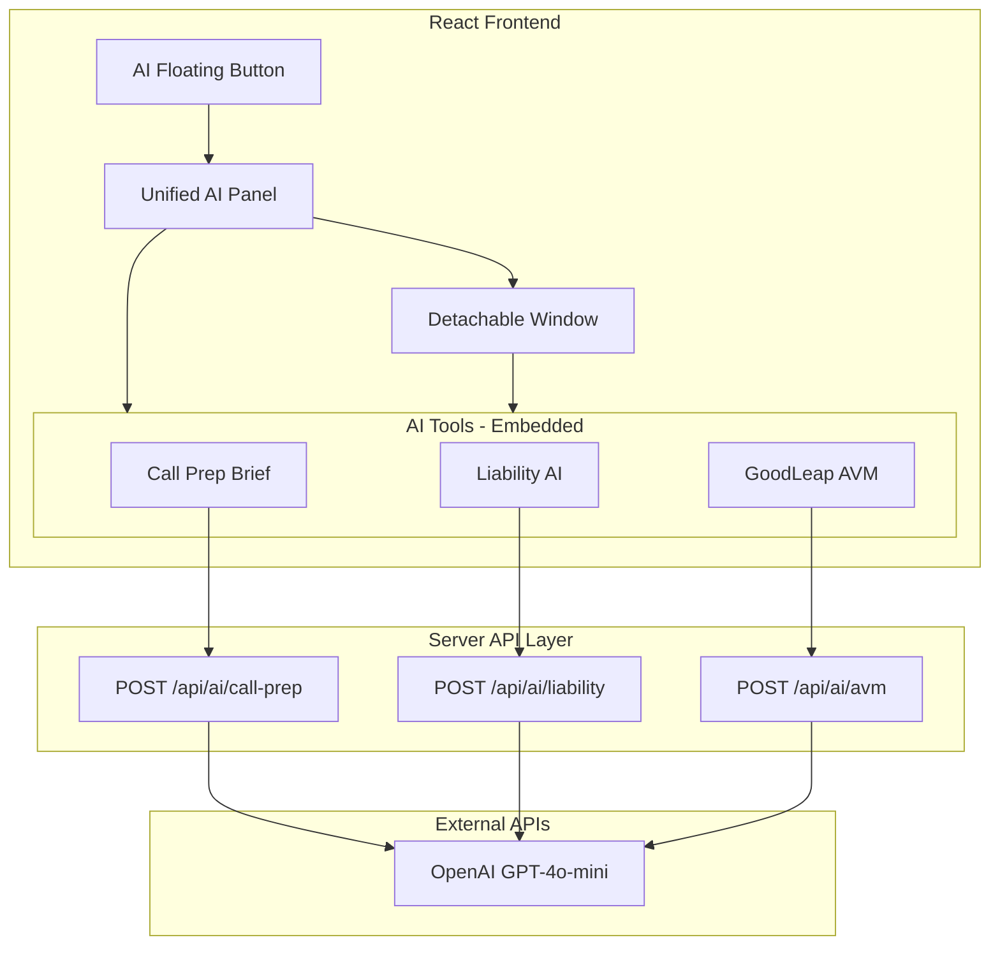
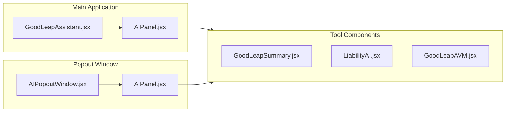

# AI Features Implementation Guide (PRD)

This document provides complete implementation specifications for three AI-powered loan officer tools delivered through a unified, detachable AI panel.

---

## Architecture Overview



> **Key Architecture Decision:** OpenAI calls are server-side only. The client never sees the API key.

---

## UI Architecture: Unified AI Panel

### Overview

All three AI tools are accessed through a single, floating AI button rather than separate sidebar quick actions. This provides:
- Consolidated AI experience
- Persistent access across all views
- Detachable/popout capability for multi-monitor workflows

### Component Structure



### File Structure

```
src/components/dashboard/
├── GoodLeapAssistant.jsx   # Floating button + panel controller
├── AIPanel.jsx              # Unified panel with tabs
├── AIPopoutWindow.jsx       # Standalone popout page
├── GoodLeapSummary.jsx      # Call Prep Brief tool (embedded: true)
├── LiabilityAI.jsx          # Liability analysis tool (embedded: true)
└── GoodLeapAVM.jsx          # Property valuation tool (embedded: true)
```

### GoodLeapAssistant.jsx

The floating trigger button that opens the AI panel.

```typescript
interface GoodLeapAssistantProps {
  accounts: Account[];
  borrowerData: BorrowerData;
}

// State management
const [isOpen, setIsOpen] = useState(false);
const [isMinimized, setIsMinimized] = useState(false);
const [isDetached, setIsDetached] = useState(false);
```

**Behavior:**
- Renders a floating button at bottom-right when closed/minimized
- Opens AIPanel when clicked
- Shows "View in window" when panel is detached
- Listens for popout window close to reset state

### AIPanel.jsx

The unified panel containing all three AI tools.

```typescript
interface AIPanelProps {
  accounts: Account[];
  borrowerData: BorrowerData;
  isOpen: boolean;
  onClose: () => void;
  onMinimize: () => void;
  isMinimized: boolean;
  defaultTool?: 'call-prep' | 'liability' | 'avm';
  isPopout?: boolean;  // true when rendered in popout window
}
```

**UI Structure:**
```
+------------------------------------------+
|  AI Assistant    [_] [↗] [×]              |  <- Header with controls
+------------------------------------------+
| [Call Prep] [Liability AI] [Property AVM] |  <- Tool selector tabs
+------------------------------------------+
|                                          |
|  (Selected tool content - embedded mode) |  <- Content area
|                                          |
+------------------------------------------+
|  AI disclaimer footer                     |  <- Footer
+------------------------------------------+
```

**Header Controls:**
- `[_]` Minimize - Collapses to floating button
- `[↗]` Popout - Opens in new browser window
- `[×]` Close - Closes the panel entirely

**Popout Implementation:**
```typescript
const handlePopout = () => {
  const width = 520;
  const height = 750;
  const left = window.screen.width - width - 50;
  const top = 50;

  const popoutWindow = window.open(
    `${window.location.origin}/?popout=ai&tool=${selectedTool}`,
    'AIPanel',
    `width=${width},height=${height},left=${left},top=${top},resizable=yes`
  );

  if (popoutWindow) {
    window.aiPanelPopout = popoutWindow;
    setIsDetached(true);
    onMinimize?.();
  }
};
```

### AIPopoutWindow.jsx

Standalone page rendered when URL contains `?popout=ai`.

```typescript
// Rendered in App.jsx when popout mode detected
const isPopout = new URLSearchParams(window.location.search).get('popout') === 'ai';

if (isPopout) {
  return <AIPopoutWindow />;
}
```

**Data Flow:**
1. Main window stores data on `window.aiPanelData`
2. Popout reads via `window.opener.aiPanelData`
3. PostMessage API for cross-window communication

### Tool Components - Embedded Mode

Each tool supports an `embedded` prop that:
- Hides the standalone header
- Shows compact refresh button in AI notice bar
- Adjusts padding for panel context

```typescript
// Example: GoodLeapSummary
export function GoodLeapSummary({ 
  accounts, 
  borrowerData, 
  onClose, 
  embedded = false  // New prop
}) {
  return (
    <div className="h-full flex flex-col bg-[#f5f5f7]">
      {/* Header - hidden when embedded */}
      {!embedded && (
        <div className="px-6 py-5 bg-white border-b">
          {/* Full header content */}
        </div>
      )}

      {/* AI Notice - always shown, compact refresh when embedded */}
      <div className="bg-amber-50 border-b flex items-center justify-between">
        <p className="text-xs text-amber-700">AI-Generated — Verify facts</p>
        {embedded && (
          <button onClick={handleRefresh}>
            <RefreshCw size={14} />
          </button>
        )}
      </div>

      {/* Content area */}
      <div className="flex-1 overflow-y-auto">
        {/* Tool-specific content */}
      </div>
    </div>
  );
}
```

### App.jsx Integration

```typescript
function App() {
  // Detect popout mode
  const isPopout = new URLSearchParams(window.location.search)
    .get('popout') === 'ai';

  // Store data for popout window access
  useEffect(() => {
    window.aiPanelData = { accounts, borrowerData };
  }, [accounts]);

  // Render popout window or main app
  if (isPopout) {
    return <AIPopoutWindow />;
  }

  return (
    <>
      <Layout>{/* Main app content */}</Layout>
      
      {/* Floating AI Assistant - always visible */}
      <GoodLeapAssistant 
        accounts={accounts} 
        borrowerData={borrowerData} 
      />
    </>
  );
}
```

### Sidebar Changes

Remove AI tools from Quick Actions:

```diff
// Sidebar.jsx - Remove these NavItems:
- <NavItem label="GoodLeap Summary" ... />
- <NavItem label="GoodLeap AVM" ... />
- <NavItem label="Liability AI" ... />
```

### CSS Classes (Bento Grid Style)

```css
/* AIPanel styling */
.ai-panel {
  @apply fixed bottom-4 right-4 z-50 w-[480px] h-[680px];
  @apply rounded-2xl overflow-hidden border border-black/10;
  @apply flex flex-col bg-[#f5f5f7] shadow-2xl;
}

.ai-panel-header {
  @apply flex items-center justify-between px-4 py-3;
  @apply bg-gradient-to-r from-purple-600 to-indigo-600 text-white;
}

.ai-panel-tabs {
  @apply flex bg-white border-b border-black/5 px-2 py-2 gap-1;
}

.ai-panel-tab {
  @apply flex-1 flex flex-col items-center gap-1 py-2 px-3 rounded-xl;
  @apply transition-all;
}

.ai-panel-tab-active {
  @apply bg-gradient-to-br from-purple-500 to-indigo-500;
  @apply text-white shadow-md;
}
```

### Keyboard Shortcuts

| Shortcut | Action |
|----------|--------|
| `Escape` | Close panel |
| `Tab` | Cycle through tools |
| `C` | Copy one-liner (Call Prep) |

---

## Scalable Tool Registry Architecture

The AI Panel uses a registry-based architecture that allows adding new tools without modifying the panel code.

### Tool Registry (`src/config/aiTools.config.js`)

All AI tools are defined in a central registry:

```javascript
export const AI_TOOLS = [
  {
    id: 'call-prep',           // Unique identifier
    label: 'Call Prep',        // Display name
    description: 'Customer briefing for calls',
    icon: Phone,               // Lucide icon component
    category: 'conversation',  // For filtering
    component: 'GoodLeapSummary', // Component name in COMPONENT_MAP
    apiEndpoint: '/api/ai/call-prep',
    keywords: ['call', 'prep', 'brief']  // For search
  },
  // ... more tools
];

export const CATEGORIES = [
  { id: 'conversation', label: 'Conversation', color: 'blue' },
  { id: 'analysis', label: 'Analysis', color: 'purple' },
  { id: 'valuation', label: 'Valuation', color: 'green' },
  { id: 'compliance', label: 'Compliance', color: 'amber' }
];
```

### Component Map (`AIPanel.jsx`)

Components are mapped by name for dynamic rendering:

```javascript
const COMPONENT_MAP = {
  'GoodLeapSummary': GoodLeapSummary,
  'LiabilityAI': LiabilityAI,
  'GoodLeapAVM': GoodLeapAVM,
  // Add new components here
};
```

### Grid UI (`AIToolGrid.jsx`)

The tool selection interface features:
- **Search bar** - Filters by label, description, and keywords
- **Category pills** - Filter by tool category
- **Responsive grid** - 3-column layout with hover effects
- **Category badges** - Color-coded by tool type

```
┌─────────────────────────────────────────────┐
│  🔍 Search AI tools...              [Filter]│
├─────────────────────────────────────────────┤
│  [All] [Conversation] [Analysis] [Valuation]│
├─────────────────────────────────────────────┤
│  ┌─────────┐ ┌─────────┐ ┌─────────┐       │
│  │   📞    │ │   💳    │ │   🏠    │       │
│  │  Call   │ │Liability│ │Property │       │
│  │  Prep   │ │   AI    │ │  AVM    │       │
│  └─────────┘ └─────────┘ └─────────┘       │
└─────────────────────────────────────────────┘
```

### Adding a New AI Tool

**Step 1:** Create the component

```bash
# Create file
touch src/components/dashboard/NewTool.jsx
```

```jsx
// src/components/dashboard/NewTool.jsx
export function NewTool({ accounts, borrowerData, embedded = false }) {
  // Tool implementation
}
```

**Step 2:** Create the API endpoint

```bash
# Create file
touch api/ai/new-tool.js
```

**Step 3:** Add to registry

```javascript
// src/config/aiTools.config.js
{
  id: 'new-tool',
  label: 'New Tool',
  description: 'What this tool does',
  icon: IconName,
  category: 'analysis',
  component: 'NewTool',
  apiEndpoint: '/api/ai/new-tool',
  keywords: ['keyword1', 'keyword2']
}
```

**Step 4:** Register component

```javascript
// src/components/dashboard/AIPanel.jsx
import { NewTool } from './NewTool';

const COMPONENT_MAP = {
  // ... existing
  'NewTool': NewTool,
};
```

**Done!** The tool will automatically appear in the grid.

### Helper Functions

```javascript
import { 
  AI_TOOLS,
  CATEGORIES,
  getToolById,
  filterTools,
  filterByCategory,
  getCategoryColorClass
} from '../config/aiTools.config';

// Get tool by ID
const tool = getToolById('liability');

// Filter by search query
const results = filterTools(AI_TOOLS, 'debt');

// Filter by category
const analysisTools = filterByCategory(AI_TOOLS, 'analysis');

// Get Tailwind classes for category badge
const colorClass = getCategoryColorClass('analysis'); 
// → 'bg-purple-100 text-purple-700'
```

---

## Environment Variables

### Server (required)
```bash
# Server-side only - NEVER expose to client
OPENAI_API_KEY=sk-your-openai-api-key
```

### Client (optional)
```bash
# For local context features (news)
VITE_NEWS_API_KEY=your-newsapi-key
```

---

## API Endpoints

### POST `/api/ai/call-prep`
Generates a structured customer briefing for loan officers.

### POST `/api/ai/liability`
Analyzes borrower liabilities for debt consolidation opportunities.

### POST `/api/ai/avm`
Selects and explains a working property value for AUS submission.

All endpoints:
- Accept JSON body with input data
- Return JSON response (validated with Zod)
- Return 422 if validation fails after repair attempt
- Include JSON repair fallback on validation errors

---

## 1. Call Prep Brief

**Purpose:** Prepare loan officers for customer conversations with a structured briefing.

### 1.1 Model Parameters

| Parameter | Value |
|-----------|-------|
| Model | `gpt-4o-mini` |
| Temperature | `0.2` |
| Max Tokens | `900` |
| top_p | `1` |
| frequency_penalty | `0` |
| presence_penalty | `0` |

### 1.2 Input Data (POST Body)

```typescript
interface CallPrepInput {
  totalDebt: number;
  monthlyObligations: number;
  estimatedEquity: number;
  creditTier: 'Prime' | 'Near Prime' | 'Subprime';
  creditScores: {
    borrower: number;
    coBorrower?: number;
  };
  goodLeapLoan: {
    hasLoan: boolean;
    purpose?: string;
    balance?: number;
    yearsSinceOrigination?: number;
  };
  property: {
    address: string;
    city: string;
    state: string;
  };
  valuation: {
    avmValue: number;
  };
  liabilities: Array<{
    creditor: string;
    type: string;
    balance: number;
    payment: number;
  }>;
}
```

### 1.3 System Prompt

```
You are an assistant helping a mortgage loan officer prepare for a first conversation.
Your job is to generate a concise, structured customer briefing using:
1) loan and liabilities data
2) property and equity context
3) localized context from web results (optional)

You must follow all rules.

HARD RULES:
1) Deterministic format. Do not change section order or bullet counts.
2) No invented facts. If something is missing, say "Not provided".
3) Do not include sensitive or creepy personalization. Keep it professional and loan focused.
4) Treat web context as low confidence. Use it only as light conversation starters, never as underwriting facts.
5) Do not mention the existence of web search tools or APIs.
6) Do not reference LTV, AUS, guidelines, approval odds, or underwriting rules.

CALCULATION RULES:
Equity:
- Total liens = sum of property lien balances
- Estimated equity = working property value − total liens
- If estimated equity <= 0, do not suggest cash-out. Suggest rate and term or credit improvement angles instead.

Debt consolidation angle:
- Focus on high interest non-mortgage debt, high monthly payment burden, and simplification.
- Never estimate LTV, never discuss guideline limits unless explicitly provided.

Output valid JSON only.
```

### 1.4 Computed Facts (Pre-processed before prompting)

The server computes these values before building the prompt:

```typescript
function computeFacts(input) {
  // Separate liens from non-mortgage debts
  const liens = liabilities.filter(l => l.type includes 'mortgage' or 'heloc');
  const nonMortgageDebts = liabilities.filter(l => !l.type includes 'mortgage');
  
  // Computed totals
  const totalLiens = sum(liens.balance);
  const totalNonMortgageDebt = sum(nonMortgageDebts.balance);
  const totalNonMortgagePayments = sum(nonMortgageDebts.payment);
  const estimatedEquity = workingPropertyValue - totalLiens;
  
  // Credit snapshot
  const creditSnapshot = coBorrower ? `${borrower} / ${coBorrower}` : `${borrower}`;
  
  return { workingPropertyValue, totalLiens, estimatedEquity, ... };
}
```

### 1.5 Response Schema

```typescript
const CallPrepBriefSchema = z.object({
  one_line_summary: z.string(),
  key_numbers: z.object({
    working_property_value: z.number(),
    total_liens: z.number(),
    estimated_equity: z.number(),
    total_non_mortgage_debt: z.number(),
    total_monthly_payments: z.number(),
    credit_snapshot: z.string()
  }),
  what_we_see: z.array(z.string()),        // 4 bullets
  how_we_can_help: z.array(z.string()),    // 3 bullets
  suggested_talk_track: z.object({
    opening_line: z.string(),
    discovery_questions: z.array(z.string()),  // 2 questions
    value_statement: z.string(),
    close_for_next_step: z.string()
  }),
  conversation_starters: z.array(z.string()),  // max 2
  missing_info_to_confirm: z.array(z.string()) // max 3
});
```

### 1.6 Client Usage

```typescript
import { generateCallPrepBrief } from '../services/goodleapSummaryLLM';

const briefing = await generateCallPrepBrief({
  // ... input data
});
```

---

## 2. Liability AI

**Purpose:** Analyze borrower liabilities for equity-based debt consolidation.

### 2.1 Model Parameters

| Parameter | Value |
|-----------|-------|
| Model | `gpt-4o-mini` |
| Temperature | `0.15` |
| Max Tokens | `1200` |
| top_p | `1` |
| frequency_penalty | `0` |
| presence_penalty | `0` |

### 2.2 Input Data (POST Body)

```typescript
interface LiabilityInput {
  accounts: Array<{
    creditor: string;
    accountType: string;
    balance: number;
    payment: number;
    interestRate?: number;
  }>;
  propertyValue: number;
  consolidationBudget?: number;  // Server calculates if not provided
  proposedRate?: number;         // Default: 7.0%
}
```

### 2.3 Interest Rate Assumptions

When actual rates are missing, the server uses these defaults:

| Account Type | Assumed Rate |
|--------------|--------------|
| Revolving / Credit Card | 22% |
| Installment / Personal Loan | 9% |
| Auto Loan | 6.5% |
| Student Loan | 5.5% |
| Mortgage / HELOC | Not estimated |

### 2.4 Prioritization Rules

When budget cannot cover all debts:
1. **Revolving / Credit Cards** (highest priority)
2. **Installment / Personal Loans**
3. **Auto Loans**
4. **Student Loans**
5. **Other / Unknown**

Within same type: Higher rate → Higher payment → Higher balance

### 2.5 System Prompt

```
You are a mortgage-focused liability analysis assistant.
Your purpose is to analyze borrower liabilities and determine whether home equity can be used to consolidate debt through a refinance or cash-out refinance.

You must follow all rules exactly.
Do not vary structure, section order, or bullet counts.
Do not speculate or invent values.

CORE RULES:
1. Use only the data provided or defined assumptions
2. Be deterministic and concise
3. Always separate facts from recommendations
4. Never double count refinanced mortgages
5. Never present speculative savings or APRs as facts
6. Do not reference LTV, AUS, guidelines, approval odds, or underwriting rules
7. Use the provided consolidation_budget number only - never recompute it

INTEREST RATE ASSUMPTIONS (Use only if rate is missing):
- Revolving / Credit card: 22%
- Installment / Personal loan: 9%
- Auto loan: 6.5%
- Student loan: 5.5%
- Mortgage / HELOC: do not estimate

If a real interest rate is present, always use it instead of assumptions.
Always disclose assumptions explicitly.

PRIORITIZATION RULES (when budget cannot cover all debts):
Rank debts in this exact order:
1) Revolving / credit cards
2) Installment / personal loans
3) Auto loans
4) Student loans
5) Other or unknown

Output valid JSON only.
```

### 2.6 Computed Facts

```typescript
function computeFacts(accounts, propertyValue, consolidationBudget) {
  // Normalize accounts with computed rates and priorities
  const normalizedAccounts = accounts.map(acc => ({
    ...acc,
    rateUsed: acc.interestRate || estimateRateByType(acc.accountType),
    rateAssumed: !acc.interestRate,
    priorityTier: getPriorityTier(acc.accountType).tier,
    priorityLabel: getPriorityTier(acc.accountType).label
  }));
  
  // Calculate totals
  const propertyLiens = accounts.filter(isMortgageOrHeloc);
  const totalLiens = sum(propertyLiens.balance);
  const estimatedEquity = propertyValue - totalLiens;
  
  return { normalizedAccounts, totalLiens, estimatedEquity, ... };
}
```

### 2.7 Response Schema

```typescript
// Credit Score Impact - safer structure (no numeric estimates)
const CreditScoreImpactSchema = z.object({
  direction: z.enum(['Likely positive', 'Neutral', 'Unclear']),
  drivers: z.array(z.string()),
  note: z.string()
});

const LiabilityAIResponseSchema = z.object({
  borrower_snapshot: z.object({
    property_value: z.number(),
    total_liens: z.number(),
    estimated_equity: z.number(),
    consolidation_budget: z.number(),
    total_monthly_non_mortgage: z.number()
  }),
  key_observations: z.array(z.string()),  // 4 bullets
  payoff_assessment: z.object({
    can_pay_all: z.boolean(),
    plan_type: z.string(),
    debts_included: z.array(z.object({
      creditor: z.string(),
      balance: z.number(),
      rate: z.string(),
      rate_assumed: z.boolean().optional(),
      monthly_payment: z.number(),
      priority: z.enum(['High Priority', 'Medium Priority', 'Low Priority'])
    })),
    debts_excluded: z.array(z.object({
      creditor: z.string(),
      reason: z.string()
    })).optional(),
    total_balance_to_payoff: z.number(),
    monthly_payments_eliminated: z.number(),
    budget_remaining: z.number()
  }),
  refinance_benefits: z.array(z.string()),  // 3 bullets
  assumptions_used: z.array(z.string()),
  credit_score_impact: CreditScoreImpactSchema.optional(),
  recommended_next_step: z.string(),
  conversation_opener: z.string()
});
```

### 2.8 UI Notes

**Consolidation Summary (NOT "Savings Hero"):**
- Show "Monthly Payments Eliminated" (sum of included payments)
- Show "Debts Consolidated" (count)
- Do NOT show estimated net savings (requires modeled new payment)
- Include disclaimer: "New mortgage payment depends on final rate and term"

**Credit Score Impact:**
- Show direction pill: "Likely positive" / "Neutral" / "Unclear"
- Show drivers as tags
- Show explanatory note
- Do NOT show numeric point estimates

---

## 3. GoodLeap AVM

**Purpose:** Select and explain a working property value for AUS submission.

### 3.1 Model Parameters

| Parameter | Value |
|-----------|-------|
| Model | `gpt-4o-mini` |
| Temperature | `0.05` |
| Max Tokens | `700` |
| top_p | `1` |
| frequency_penalty | `0` |
| presence_penalty | `0` |

### 3.2 Input Data (POST Body)

```typescript
interface PropertyInput {
  address?: string;
  city?: string;
  state?: string;
  livingArea?: number;
  yearBuilt?: number;
  avmValue?: number;
  avmLow?: number;
  avmHigh?: number;
  confidence?: number;
  zillowValue?: number;
  redfinValue?: number;
  realtorValue?: number;
}
```

### 3.3 System Prompt

```
You are a mortgage property valuation assistant.
Your job is to select and explain a working property value for AUS usage using internal and external AVMs.

Follow all rules strictly.
Do not invent values.
Do not change section order or labels.

SELECTION RULES:
1) Prefer internal AVM when supported by low variance
2) Avoid highest value unless supported by multiple sources
3) Favor consistency and explainability over optimism
4) Do not reference LTV, guidelines, or approval guarantees

Output valid JSON only.
```

### 3.4 Computed Facts

```typescript
function computeFacts(property) {
  const values = [internalAvm, zillowValue, redfinValue, realtorValue].filter(v => v);
  const sourceCount = values.length;
  const minValue = Math.min(...values);
  const maxValue = Math.max(...values);
  const medianValue = median(values);
  const variancePercent = ((maxValue - minValue) / medianValue * 100);
  
  // Confidence based on variance
  let confidenceLevel = 'High';
  if (variancePercent > 10) confidenceLevel = 'Low';
  else if (variancePercent > 5) confidenceLevel = 'Medium';
  
  return { sourceCount, minValue, maxValue, medianValue, variancePercent, ... };
}
```

### 3.5 Response Schema

```typescript
const AVMResponseSchema = z.object({
  aus_recommended: z.object({
    value: z.number(),
    confidence: z.enum(['High', 'Medium', 'Low']),
    reason: z.string()
  }),
  value_options: z.object({
    conservative: z.object({
      value: z.number(),
      label: z.string(),
      description: z.string()
    }),
    blended: z.object({
      value: z.number(),
      label: z.string(),
      description: z.string()
    }),
    aggressive: z.object({
      value: z.number(),
      label: z.string(),
      description: z.string()
    })
  }),
  source_comparison: z.object({
    internal_avm: z.object({ value: z.number(), confidence: z.string().optional() }),
    zillow: z.object({ value: z.number().nullable() }),
    redfin: z.object({ value: z.number().nullable() }),
    realtor: z.object({ value: z.number().nullable() }),
    value_range: z.object({ min: z.number(), max: z.number() }),
    variance_percent: z.number()
  }),
  underwriting_readiness: z.object({
    multiple_sources: z.boolean(),
    variance_within_tolerance: z.boolean(),
    internal_alignment: z.boolean(),
    suitable_for_aus: z.enum(['Yes', 'Use with caution'])
  }),
  important_notes: z.array(z.string())
});
```

---

## 4. JSON Repair Mechanism

All API endpoints include automatic JSON repair on validation failure:

```typescript
async function repairJSON(client, invalidJSON, schemaDescription) {
  const repairPrompt = `You are a JSON formatter. Return ONLY valid JSON.

INVALID JSON:
${invalidJSON}

REQUIRED SCHEMA:
${schemaDescription}

INSTRUCTIONS:
- Keep the same values from the invalid JSON
- Only fix structure and types
- Do not add new facts
- Return valid JSON only`;

  const response = await client.chat.completions.create({
    model: 'gpt-4o-mini',
    messages: [
      { role: 'system', content: 'You are a JSON formatter. Return ONLY valid JSON.' },
      { role: 'user', content: repairPrompt }
    ],
    temperature: 0,
    max_tokens: 1200,
    response_format: { type: 'json_object' }
  });

  return response.choices[0]?.message?.content;
}
```

**Flow:**
1. OpenAI returns response
2. Parse JSON
3. Validate with Zod schema
4. If invalid: call repair prompt
5. Parse and validate again
6. If still invalid: return HTTP 422 with error details

---

## 5. Error Responses

### 422 Validation Error
```json
{
  "error": "Validation failed after repair attempt",
  "details": [
    { "path": ["key_numbers", "total_liens"], "message": "Expected number" }
  ],
  "raw": { /* original parsed JSON */ }
}
```

### 500 Server Error
```json
{
  "error": "Failed to generate briefing",
  "details": "OpenAI API rate limit exceeded"
}
```

---

## 6. Local Development

### Setup
```bash
# Install dependencies
npm install

# Create .env.local with:
OPENAI_API_KEY=sk-your-key

# Run both client and server
npm run dev

# Or run separately
npm run dev:client  # Vite on :5173
npm run dev:server  # Express on :3001
```

### Client API Base URL
```typescript
const API_BASE = import.meta.env.PROD 
  ? '/api/ai'              // Production: Vercel functions
  : 'http://localhost:3001/api/ai';  // Dev: local Express
```

---

## 7. Deployment (Vercel)

### vercel.json
```json
{
  "rewrites": [
    { "source": "/api/:path*", "destination": "/api/:path*" },
    { "source": "/(.*)", "destination": "/" }
  ],
  "functions": {
    "api/**/*.js": {
      "memory": 1024,
      "maxDuration": 30
    }
  }
}
```

### Environment Variables in Vercel
- Add `OPENAI_API_KEY` in Vercel project settings
- Do NOT add `VITE_` prefix (server-side only)

---

## 8. Disclaimer

All AI panels must display:

```jsx
<div className="px-6 py-2 bg-amber-50 border-b border-amber-100">
  <p className="text-xs text-amber-700">
    <span className="font-semibold">AI-Generated Analysis</span> — 
    Estimates only. Verify before financial decisions.
  </p>
</div>
```
