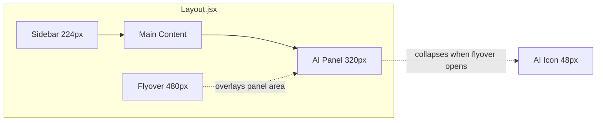
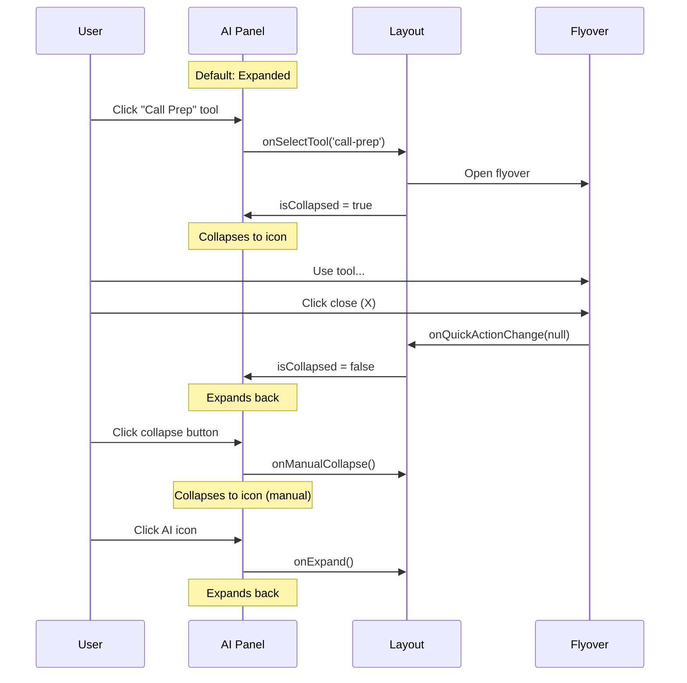
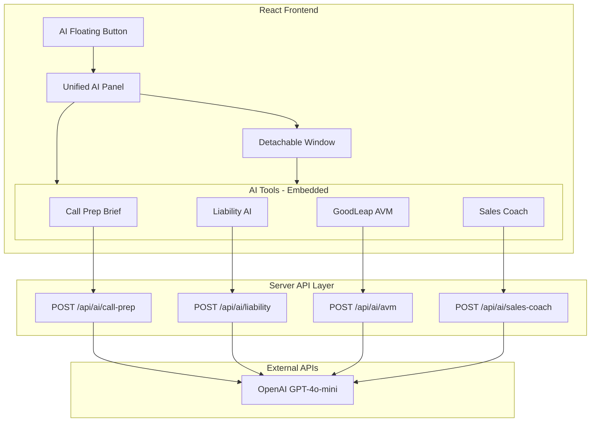
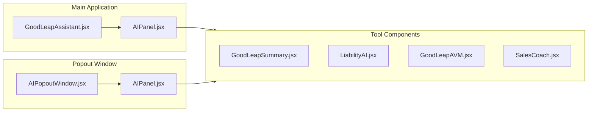
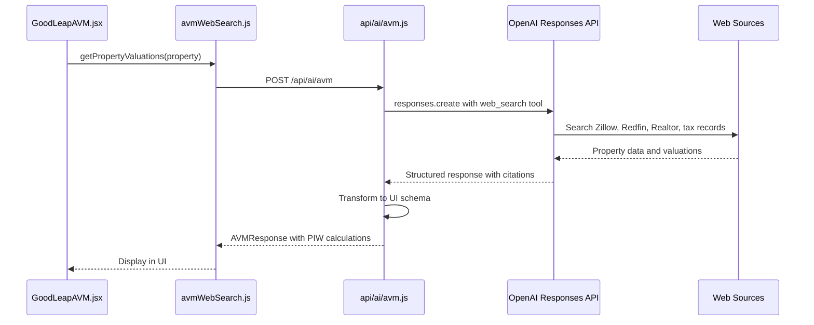

# AI Features Implementation Guide (PRD)

This document provides complete implementation specifications for three AI-powered loan officer tools delivered through a unified, detachable AI panel.

---

## Permanent AI Panel Architecture

### Overview

The AI Assistant lives as a **permanent right panel** that is always visible by default. This provides:
- Immediate access to AI tools without navigation
- Persistent context across all dashboard views
- Seamless integration with flyover system
- User control over panel visibility

### Component Structure



### File Structure

```
src/components/layout/
├── Layout.jsx              # Main layout with AI panel integration
├── AIPanelPermanent.jsx    # Permanent AI panel component
├── Sidebar.jsx             # Left navigation
└── BorrowerHeader.jsx      # Top header
```

### Panel States

The AI panel has three distinct states:

| State | Trigger | Main Content Margin | Panel Width | Visual |
|-------|---------|---------------------|-------------|--------|
| **Expanded** | Default | `mr-[320px]` | 320px | Full AI tools grid |
| **Collapsed (Manual)** | User clicks collapse | None | 48px icon | Floating AI button |
| **Collapsed (Flyover)** | Flyover opens | `mr-[480px]` | 48px icon | Floating AI button |

### Visual Layout

```
STATE 1: Expanded (Default)
+----------+---------------------------+----------+
|          |                           |   AI     |
| Sidebar  |      Main Content         |  Panel   |
|  224px   |        flex-1             |  320px   |
|          |                           | [collapse]|
+----------+---------------------------+----------+

STATE 2: Manually Collapsed
+----------+--------------------------------------+------+
|          |                                      | [AI] |
| Sidebar  |        Full Width Main Content       | icon |
|  224px   |              flex-1                  | 48px |
+----------+--------------------------------------+------+

STATE 3: Flyover Open (Auto-Collapsed)
+----------+---------------------+---------+------+
|          |                     |         | [AI] |
| Sidebar  |   Main Content      | Flyover | icon |
|  224px   |      flex-1         |  480px  | 48px |
+----------+---------------------+---------+------+
```

### AIPanelPermanent.jsx

```typescript
interface AIPanelPermanentProps {
  isCollapsed: boolean;           // True when flyover is open
  isManuallyCollapsed: boolean;   // True when user collapsed
  onExpand: () => void;           // Called when icon clicked
  onManualCollapse: () => void;   // Called when collapse button clicked
  onSelectTool: (toolId: string) => void;  // Opens tool in flyover
  accounts: Account[];
  borrowerData: BorrowerData;
}
```

**Expanded State UI:**
```
+------------------------------------------+
|  [Icon] AI Assistant            [collapse]|  <- Header with collapse button
+------------------------------------------+
|  🔍 Search tools...                       |  <- Search input
+------------------------------------------+
|  [All] [Conversation] [Analysis] [...]    |  <- Category filters
+------------------------------------------+
|  +------------------+  +------------------+
|  | 📞 Call Prep     |  | 💳 Liability AI  |
|  | Customer brief   |  | Debt analysis    |
|  +------------------+  +------------------+
|  +------------------+                      |
|  | 🏠 Property AVM  |                      |
|  | Valuation...     |                      |
|  +------------------+                      |  <- Tool cards
+------------------------------------------+
|  AI-generated content. Verify details.    |  <- Disclaimer footer
+------------------------------------------+
```

**Collapsed State UI:**
```
+--------+
|   ✨   |  <- Floating button, fixed right edge
|   AI   |     vertically centered
+--------+
```

### Layout.jsx Integration

```typescript
export function Layout({ 
  children, 
  rightPanel,           // Flyover content (null if no flyover)
  onQuickActionChange,  // Callback to open flyover
  accounts,
  borrowerData
}) {
  // Manual collapse state - user preference
  const [isManuallyCollapsed, setIsManuallyCollapsed] = useState(false);

  // Derived states
  const hasFlyover = !!rightPanel;
  const isPanelVisible = !hasFlyover && !isManuallyCollapsed;

  // Handlers
  const handleExpand = () => {
    if (hasFlyover) {
      onQuickActionChange(null);  // Close flyover
    } else {
      setIsManuallyCollapsed(false);  // Expand panel
    }
  };

  const handleManualCollapse = () => {
    setIsManuallyCollapsed(true);
  };

  return (
    <div className="flex">
      <Sidebar />
      <main className={cn(
        "flex-1 ml-56",
        hasFlyover ? "mr-[480px]" : isPanelVisible ? "mr-[320px]" : ""
      )}>
        {children}
      </main>
      
      {/* Permanent AI Panel */}
      <AIPanelPermanent 
        isCollapsed={hasFlyover}
        isManuallyCollapsed={isManuallyCollapsed}
        onExpand={handleExpand}
        onManualCollapse={handleManualCollapse}
        onSelectTool={onQuickActionChange}
        accounts={accounts}
        borrowerData={borrowerData}
      />
      
      {/* Flyover overlay */}
      {rightPanel && (
        <div className="fixed right-0 w-[480px] ...">
          {rightPanel}
        </div>
      )}
    </div>
  );
}
```

### Interaction Flow



### Tool Selection Mapping

When a user clicks a tool card in the AI panel, the tool ID is mapped to the appropriate quick action:

```typescript
// App.jsx
const AI_TOOL_MAPPING = {
  'call-prep': 'Call Prep Brief',
  'liability': 'Liability AI',
  'avm': 'Property AVM'
};

const handleQuickActionChange = (action) => {
  const mappedAction = AI_TOOL_MAPPING[action] || action;
  setActiveQuickAction(mappedAction);
};
```

### CSS Classes

```css
/* Permanent AI Panel */
.ai-panel-permanent {
  @apply fixed right-0 top-0 bottom-0 w-[320px];
  @apply bg-white border-l border-stone-200 shadow-lg z-10;
  @apply flex flex-col;
}

.ai-panel-header {
  @apply px-4 py-4 border-b border-stone-200;
  @apply bg-gradient-to-r from-indigo-50 to-purple-50;
}

.ai-panel-collapse-btn {
  @apply p-1.5 rounded-lg hover:bg-stone-200/50;
  @apply text-stone-400 hover:text-stone-600 transition-colors;
}

/* Collapsed icon button */
.ai-panel-collapsed-icon {
  @apply fixed right-4 top-1/2 -translate-y-1/2 z-30;
  @apply flex flex-col items-center gap-1 px-3 py-4;
  @apply bg-gradient-to-b from-indigo-500 to-purple-600 text-white;
  @apply rounded-xl shadow-lg hover:shadow-xl hover:scale-105;
  @apply transition-all duration-200;
}

/* Tool cards */
.ai-tool-card {
  @apply w-full flex items-center gap-3 p-3;
  @apply bg-white border border-stone-200 rounded-xl;
  @apply hover:border-indigo-300 hover:shadow-md hover:bg-indigo-50/30;
  @apply transition-all;
}
```

### Keyboard Shortcuts

| Shortcut | Action |
|----------|--------|
| `Escape` | Close flyover (if open) |
| `A` | Toggle AI panel expand/collapse |

### Accessibility

- Panel collapse button has `title="Collapse panel"`
- Collapsed icon has `title="Open AI Assistant"`
- All interactive elements are keyboard accessible
- Focus management when panel state changes

---

## Architecture Overview



> **Key Architecture Decision:** OpenAI calls are server-side only. The client never sees the API key.

---

## UI Architecture: Unified AI Panel

### Overview

All three AI tools are accessed through a single, floating AI button rather than separate sidebar quick actions. This provides:
- Consolidated AI experience
- Persistent access across all views
- Detachable/popout capability for multi-monitor workflows

### Component Structure



### File Structure

```
src/components/dashboard/
├── GoodLeapAssistant.jsx   # Floating button + panel controller
├── AIPanel.jsx              # Unified panel with tabs
├── AIPopoutWindow.jsx       # Standalone popout page
├── GoodLeapSummary.jsx      # Call Prep Brief tool (embedded: true)
├── LiabilityAI.jsx          # Liability analysis tool (embedded: true)
├── GoodLeapAVM.jsx          # Property valuation tool (embedded: true)
└── SalesCoach.jsx           # Conversational sales coach (embedded: true)
```

### GoodLeapAssistant.jsx

The floating trigger button that opens the AI panel.

```typescript
interface GoodLeapAssistantProps {
  accounts: Account[];
  borrowerData: BorrowerData;
}

// State management
const [isOpen, setIsOpen] = useState(false);
const [isMinimized, setIsMinimized] = useState(false);
const [isDetached, setIsDetached] = useState(false);
```

**Behavior:**
- Renders a floating button at bottom-right when closed/minimized
- Opens AIPanel when clicked
- Shows "View in window" when panel is detached
- Listens for popout window close to reset state

### AIPanel.jsx

The unified panel containing all three AI tools.

```typescript
interface AIPanelProps {
  accounts: Account[];
  borrowerData: BorrowerData;
  isOpen: boolean;
  onClose: () => void;
  onMinimize: () => void;
  isMinimized: boolean;
  defaultTool?: 'call-prep' | 'liability' | 'avm';
  isPopout?: boolean;  // true when rendered in popout window
}
```

**UI Structure:**
```
+------------------------------------------+
|  AI Assistant    [_] [↗] [×]              |  <- Header with controls
+------------------------------------------+
| [Call Prep] [Liability AI] [Property AVM] |  <- Tool selector tabs
+------------------------------------------+
|                                          |
|  (Selected tool content - embedded mode) |  <- Content area
|                                          |
+------------------------------------------+
|  AI disclaimer footer                     |  <- Footer
+------------------------------------------+
```

**Header Controls:**
- `[_]` Minimize - Collapses to floating button
- `[↗]` Popout - Opens in new browser window
- `[×]` Close - Closes the panel entirely

**Popout Implementation:**
```typescript
const handlePopout = () => {
  const width = 520;
  const height = 750;
  const left = window.screen.width - width - 50;
  const top = 50;

  const popoutWindow = window.open(
    `${window.location.origin}/?popout=ai&tool=${selectedTool}`,
    'AIPanel',
    `width=${width},height=${height},left=${left},top=${top},resizable=yes`
  );

  if (popoutWindow) {
    window.aiPanelPopout = popoutWindow;
    setIsDetached(true);
    onMinimize?.();
  }
};
```

### AIPopoutWindow.jsx

Standalone page rendered when URL contains `?popout=ai`.

```typescript
// Rendered in App.jsx when popout mode detected
const isPopout = new URLSearchParams(window.location.search).get('popout') === 'ai';

if (isPopout) {
  return <AIPopoutWindow />;
}
```

**Data Flow:**
1. Main window stores data on `window.aiPanelData`
2. Popout reads via `window.opener.aiPanelData`
3. PostMessage API for cross-window communication

### Tool Components - Embedded Mode

Each tool supports an `embedded` prop that:
- Hides the standalone header
- Shows compact refresh button in AI notice bar
- Adjusts padding for panel context

```typescript
// Example: GoodLeapSummary
export function GoodLeapSummary({ 
  accounts, 
  borrowerData, 
  onClose, 
  embedded = false  // New prop
}) {
  return (
    <div className="h-full flex flex-col bg-[#f5f5f7]">
      {/* Header - hidden when embedded */}
      {!embedded && (
        <div className="px-6 py-5 bg-white border-b">
          {/* Full header content */}
        </div>
      )}

      {/* AI Notice - always shown, compact refresh when embedded */}
      <div className="bg-amber-50 border-b flex items-center justify-between">
        <p className="text-xs text-amber-700">AI-Generated — Verify facts</p>
        {embedded && (
          <button onClick={handleRefresh}>
            <RefreshCw size={14} />
          </button>
        )}
      </div>

      {/* Content area */}
      <div className="flex-1 overflow-y-auto">
        {/* Tool-specific content */}
      </div>
    </div>
  );
}
```

### App.jsx Integration

```typescript
function App() {
  // Detect popout mode
  const isPopout = new URLSearchParams(window.location.search)
    .get('popout') === 'ai';

  // Store data for popout window access
  useEffect(() => {
    window.aiPanelData = { accounts, borrowerData };
  }, [accounts]);

  // Render popout window or main app
  if (isPopout) {
    return <AIPopoutWindow />;
  }

  return (
    <>
      <Layout>{/* Main app content */}</Layout>
      
      {/* Floating AI Assistant - always visible */}
      <GoodLeapAssistant 
        accounts={accounts} 
        borrowerData={borrowerData} 
      />
    </>
  );
}
```

### Sidebar Changes

Remove AI tools from Quick Actions:

```diff
// Sidebar.jsx - Remove these NavItems:
- <NavItem label="GoodLeap Summary" ... />
- <NavItem label="GoodLeap AVM" ... />
- <NavItem label="Sales Coach AI" ... />
```

### CSS Classes (Bento Grid Style)

```css
/* AIPanel styling */
.ai-panel {
  @apply fixed bottom-4 right-4 z-50 w-[480px] h-[680px];
  @apply rounded-2xl overflow-hidden border border-black/10;
  @apply flex flex-col bg-[#f5f5f7] shadow-2xl;
}

.ai-panel-header {
  @apply flex items-center justify-between px-4 py-3;
  @apply bg-gradient-to-r from-purple-600 to-indigo-600 text-white;
}

.ai-panel-tabs {
  @apply flex bg-white border-b border-black/5 px-2 py-2 gap-1;
}

.ai-panel-tab {
  @apply flex-1 flex flex-col items-center gap-1 py-2 px-3 rounded-xl;
  @apply transition-all;
}

.ai-panel-tab-active {
  @apply bg-gradient-to-br from-purple-500 to-indigo-500;
  @apply text-white shadow-md;
}
```

### Keyboard Shortcuts

| Shortcut | Action |
|----------|--------|
| `Escape` | Close panel |
| `Tab` | Cycle through tools |
| `C` | Copy one-liner (Call Prep) |

---

## Scalable Tool Registry Architecture

The AI Panel uses a registry-based architecture that allows adding new tools without modifying the panel code.

### Tool Registry (`src/config/aiTools.config.js`)

All AI tools are defined in a central registry:

```javascript
export const AI_TOOLS = [
  {
    id: 'call-prep',           // Unique identifier
    label: 'Call Prep',        // Display name
    description: 'Customer briefing for calls',
    icon: Phone,               // Lucide icon component
    category: 'conversation',  // For filtering
    component: 'GoodLeapSummary', // Component name in COMPONENT_MAP
    apiEndpoint: '/api/ai/call-prep',
    keywords: ['call', 'prep', 'brief']  // For search
  },
  // ... more tools
];

export const CATEGORIES = [
  { id: 'conversation', label: 'Conversation', color: 'blue' },
  { id: 'analysis', label: 'Analysis', color: 'purple' },
  { id: 'valuation', label: 'Valuation', color: 'green' },
  { id: 'compliance', label: 'Compliance', color: 'amber' }
];
```

### Component Map (`AIPanel.jsx`)

Components are mapped by name for dynamic rendering:

```javascript
const COMPONENT_MAP = {
  'GoodLeapSummary': GoodLeapSummary,
  'LiabilityAI': LiabilityAI,
  'GoodLeapAVM': GoodLeapAVM,
  'SalesCoach': SalesCoach,
  // Add new components here
};
```

### Grid UI (`AIToolGrid.jsx`)

The tool selection interface features:
- **Search bar** - Filters by label, description, and keywords
- **Category pills** - Filter by tool category
- **Responsive grid** - 3-column layout with hover effects
- **Category badges** - Color-coded by tool type

```
┌─────────────────────────────────────────────┐
│  🔍 Search AI tools...              [Filter]│
├─────────────────────────────────────────────┤
│  [All] [Conversation] [Analysis] [Valuation]│
├─────────────────────────────────────────────┤
│  ┌─────────┐ ┌─────────┐ ┌─────────┐       │
│  │   📞    │ │   💳    │ │   🏠    │       │
│  │  Call   │ Sales Coach    │ │  AVM    │       │
│  └─────────┘ └─────────┘ └─────────┘       │
│                               │
│                               │
└─────────────────────────────────────────────┘
```

### Adding a New AI Tool

**Step 1:** Create the component

```bash
# Create file
touch src/components/dashboard/NewTool.jsx
```

```jsx
// src/components/dashboard/NewTool.jsx
export function NewTool({ accounts, borrowerData, embedded = false }) {
  // Tool implementation
}
```

**Step 2:** Create the API endpoint

```bash
# Create file
touch api/ai/new-tool.js
```

**Step 3:** Add to registry

```javascript
// src/config/aiTools.config.js
{
  id: 'new-tool',
  label: 'New Tool',
  description: 'What this tool does',
  icon: IconName,
  category: 'analysis',
  component: 'NewTool',
  apiEndpoint: '/api/ai/new-tool',
  keywords: ['keyword1', 'keyword2']
}
```

**Step 4:** Register component

```javascript
// src/components/dashboard/AIPanel.jsx
import { NewTool } from './NewTool';

const COMPONENT_MAP = {
  // ... existing
  'NewTool': NewTool,
};
```

**Done!** The tool will automatically appear in the grid.

### Helper Functions

```javascript
import { 
  AI_TOOLS,
  CATEGORIES,
  getToolById,
  filterTools,
  filterByCategory,
  getCategoryColorClass
} from '../config/aiTools.config';

// Get tool by ID
const tool = getToolById('liability');

// Filter by search query
const results = filterTools(AI_TOOLS, 'debt');

// Filter by category
const analysisTools = filterByCategory(AI_TOOLS, 'analysis');

// Get Tailwind classes for category badge
const colorClass = getCategoryColorClass('analysis'); 
// → 'bg-purple-100 text-purple-700'
```

---

## Environment Variables

### Server (required)
```bash
# Server-side only - NEVER expose to client
OPENAI_API_KEY=sk-your-openai-api-key
```

### Client (optional)
```bash
# For local context features (news)
VITE_NEWS_API_KEY=your-newsapi-key
```

---

## API Endpoints

### POST `/api/ai/call-prep`
Generates a structured customer briefing for loan officers.

### POST `/api/ai/liability`
Analyzes borrower liabilities for debt consolidation opportunities.

### POST `/api/ai/avm`
Selects and explains a working property value for AUS submission.

### POST `/api/ai/sales-coach`
Conversational AI for objection handling and benefit calculation. Accepts message history and loan scenario context. Returns natural language responses (not JSON).

All endpoints:
- Accept JSON body with input data
- Return JSON response (validated with Zod)
- Return 422 if validation fails after repair attempt
- Include JSON repair fallback on validation errors

---

## 1. Call Prep Brief

**Purpose:** Prepare loan officers for customer conversations with a structured briefing.

### 1.1 Model Parameters

| Parameter | Value |
|-----------|-------|
| Model | `gpt-4o-mini` |
| Temperature | `0.2` |
| Max Tokens | `900` |
| top_p | `1` |
| frequency_penalty | `0` |
| presence_penalty | `0` |

### 1.2 Input Data (POST Body)

```typescript
interface CallPrepInput {
  totalDebt: number;
  monthlyObligations: number;
  estimatedEquity: number;
  creditTier: 'Prime' | 'Near Prime' | 'Subprime';
  creditScores: {
    borrower: number;
    coBorrower?: number;
  };
  goodLeapLoan: {
    hasLoan: boolean;
    purpose?: string;
    balance?: number;
    yearsSinceOrigination?: number;
  };
  property: {
    address: string;
    city: string;
    state: string;
  };
  valuation: {
    avmValue: number;
  };
  liabilities: Array<{
    creditor: string;
    type: string;
    balance: number;
    payment: number;
  }>;
}
```

### 1.3 System Prompt

```
You are an assistant helping a mortgage loan officer prepare for a first conversation.
Your job is to generate a concise, structured customer briefing using:
1) loan and liabilities data
2) property and equity context
3) localized context from web results (optional)

You must follow all rules.

HARD RULES:
1) Deterministic format. Do not change section order or bullet counts.
2) No invented facts. If something is missing, say "Not provided".
3) Do not include sensitive or creepy personalization. Keep it professional and loan focused.
4) Treat web context as low confidence. Use it only as light conversation starters, never as underwriting facts.
5) Do not mention the existence of web search tools or APIs.
6) Do not reference LTV, AUS, guidelines, approval odds, or underwriting rules.

CALCULATION RULES:
Equity:
- Total liens = sum of property lien balances
- Estimated equity = working property value − total liens
- If estimated equity <= 0, do not suggest cash-out. Suggest rate and term or credit improvement angles instead.

Debt consolidation angle:
- Focus on high interest non-mortgage debt, high monthly payment burden, and simplification.
- Never estimate LTV, never discuss guideline limits unless explicitly provided.

Output valid JSON only.
```

### 1.4 Computed Facts (Pre-processed before prompting)

The server computes these values before building the prompt:

```typescript
function computeFacts(input) {
  // Separate liens from non-mortgage debts
  const liens = liabilities.filter(l => l.type includes 'mortgage' or 'heloc');
  const nonMortgageDebts = liabilities.filter(l => !l.type includes 'mortgage');
  
  // Computed totals
  const totalLiens = sum(liens.balance);
  const totalNonMortgageDebt = sum(nonMortgageDebts.balance);
  const totalNonMortgagePayments = sum(nonMortgageDebts.payment);
  const estimatedEquity = workingPropertyValue - totalLiens;
  
  // Credit snapshot
  const creditSnapshot = coBorrower ? `${borrower} / ${coBorrower}` : `${borrower}`;
  
  return { workingPropertyValue, totalLiens, estimatedEquity, ... };
}
```

### 1.5 Response Schema

```typescript
const CallPrepBriefSchema = z.object({
  one_line_summary: z.string(),
  key_numbers: z.object({
    working_property_value: z.number(),
    total_liens: z.number(),
    estimated_equity: z.number(),
    total_non_mortgage_debt: z.number(),
    total_monthly_payments: z.number(),
    credit_snapshot: z.string()
  }),
  what_we_see: z.array(z.string()),        // 4 bullets
  how_we_can_help: z.array(z.string()),    // 3 bullets
  suggested_talk_track: z.object({
    opening_line: z.string(),
    discovery_questions: z.array(z.string()),  // 2 questions
    value_statement: z.string(),
    close_for_next_step: z.string()
  }),
  conversation_starters: z.array(z.string()),  // max 2
  missing_info_to_confirm: z.array(z.string()) // max 3
});
```

### 1.6 Client Usage

```typescript
import { generateCallPrepBrief } from '../services/goodleapSummaryLLM';

const briefing = await generateCallPrepBrief({
  // ... input data
});
```

---

## 2. Liability AI

**Purpose:** Analyze borrower liabilities for equity-based debt consolidation.

### 2.1 Model Parameters

| Parameter | Value |
|-----------|-------|
| Model | `gpt-4o-mini` |
| Temperature | `0.15` |
| Max Tokens | `1200` |
| top_p | `1` |
| frequency_penalty | `0` |
| presence_penalty | `0` |

### 2.2 Input Data (POST Body)

```typescript
interface LiabilityInput {
  accounts: Array<{
    creditor: string;
    accountType: string;
    balance: number;
    payment: number;
    interestRate?: number;
  }>;
  propertyValue: number;
  consolidationBudget?: number;  // Server calculates if not provided
  proposedRate?: number;         // Default: 7.0%
}
```

### 2.3 Interest Rate Assumptions

When actual rates are missing, the server uses these defaults:

| Account Type | Assumed Rate |
|--------------|--------------|
| Revolving / Credit Card | 22% |
| Installment / Personal Loan | 9% |
| Auto Loan | 6.5% |
| Student Loan | 5.5% |
| Mortgage / HELOC | Not estimated |

### 2.4 Prioritization Rules

When budget cannot cover all debts:
1. **Revolving / Credit Cards** (highest priority)
2. **Installment / Personal Loans**
3. **Auto Loans**
4. **Student Loans**
5. **Other / Unknown**

Within same type: Higher rate → Higher payment → Higher balance

### 2.5 System Prompt

```
You are a mortgage-focused liability analysis assistant.
Your purpose is to analyze borrower liabilities and determine whether home equity can be used to consolidate debt through a refinance or cash-out refinance.

You must follow all rules exactly.
Do not vary structure, section order, or bullet counts.
Do not speculate or invent values.

CORE RULES:
1. Use only the data provided or defined assumptions
2. Be deterministic and concise
3. Always separate facts from recommendations
4. Never double count refinanced mortgages
5. Never present speculative savings or APRs as facts
6. Do not reference LTV, AUS, guidelines, approval odds, or underwriting rules
7. Use the provided consolidation_budget number only - never recompute it

INTEREST RATE ASSUMPTIONS (Use only if rate is missing):
- Revolving / Credit card: 22%
- Installment / Personal loan: 9%
- Auto loan: 6.5%
- Student loan: 5.5%
- Mortgage / HELOC: do not estimate

If a real interest rate is present, always use it instead of assumptions.
Always disclose assumptions explicitly.

PRIORITIZATION RULES (when budget cannot cover all debts):
Rank debts in this exact order:
1) Revolving / credit cards
2) Installment / personal loans
3) Auto loans
4) Student loans
5) Other or unknown

Output valid JSON only.
```

### 2.6 Computed Facts

```typescript
function computeFacts(accounts, propertyValue, consolidationBudget) {
  // Normalize accounts with computed rates and priorities
  const normalizedAccounts = accounts.map(acc => ({
    ...acc,
    rateUsed: acc.interestRate || estimateRateByType(acc.accountType),
    rateAssumed: !acc.interestRate,
    priorityTier: getPriorityTier(acc.accountType).tier,
    priorityLabel: getPriorityTier(acc.accountType).label
  }));
  
  // Calculate totals
  const propertyLiens = accounts.filter(isMortgageOrHeloc);
  const totalLiens = sum(propertyLiens.balance);
  const estimatedEquity = propertyValue - totalLiens;
  
  return { normalizedAccounts, totalLiens, estimatedEquity, ... };
}
```

### 2.7 Response Schema

```typescript
// Credit Score Impact - safer structure (no numeric estimates)
const CreditScoreImpactSchema = z.object({
  direction: z.enum(['Likely positive', 'Neutral', 'Unclear']),
  drivers: z.array(z.string()),
  note: z.string()
});

const LiabilityAIResponseSchema = z.object({
  borrower_snapshot: z.object({
    property_value: z.number(),
    total_liens: z.number(),
    estimated_equity: z.number(),
    consolidation_budget: z.number(),
    total_monthly_non_mortgage: z.number()
  }),
  key_observations: z.array(z.string()),  // 4 bullets
  payoff_assessment: z.object({
    can_pay_all: z.boolean(),
    plan_type: z.string(),
    debts_included: z.array(z.object({
      creditor: z.string(),
      balance: z.number(),
      rate: z.string(),
      rate_assumed: z.boolean().optional(),
      monthly_payment: z.number(),
      priority: z.enum(['High Priority', 'Medium Priority', 'Low Priority'])
    })),
    debts_excluded: z.array(z.object({
      creditor: z.string(),
      reason: z.string()
    })).optional(),
    total_balance_to_payoff: z.number(),
    monthly_payments_eliminated: z.number(),
    budget_remaining: z.number()
  }),
  refinance_benefits: z.array(z.string()),  // 3 bullets
  assumptions_used: z.array(z.string()),
  credit_score_impact: CreditScoreImpactSchema.optional(),
  recommended_next_step: z.string(),
  conversation_opener: z.string()
});
```

### 2.8 UI Notes

**Consolidation Summary (NOT "Savings Hero"):**
- Show "Monthly Payments Eliminated" (sum of included payments)
- Show "Debts Consolidated" (count)
- Do NOT show estimated net savings (requires modeled new payment)
- Include disclaimer: "New mortgage payment depends on final rate and term"

**Credit Score Impact:**
- Show direction pill: "Likely positive" / "Neutral" / "Unclear"
- Show drivers as tags
- Show explanatory note
- Do NOT show numeric point estimates

---

## 3. GoodLeap AVM (with OpenAI Web Search)

**Purpose:** Select and explain a working property value for AUS submission and PIW optimization using real-time property data from multiple sources.

### 3.1 Architecture Overview

The AVM tool uses OpenAI's **Responses API** with the built-in `web_search` tool to fetch real-time property valuations from multiple sources (Zillow, Redfin, Realtor.com, etc.) instead of hardcoded values.



### 3.2 Model Parameters

| Parameter | Value |
|-----------|-------|
| Model | `gpt-4o` |
| API | Responses API (not Chat Completions) |
| Tools | `[{ type: 'web_search' }]` |

### 3.3 Input Data (POST Body)

```typescript
interface PropertyInput {
  address?: string;      // Default: '2116 Shrewsbury Dr'
  city?: string;         // Default: 'McKinney'
  state?: string;        // Default: 'TX'
  zip?: string;          // Default: '75071'
  livingArea?: number;
  yearBuilt?: number;
  bedrooms?: number;
  bathrooms?: number;
}
```

### 3.4 System Prompt

```
You are an AI valuation tool used by a mortgage sales team.
Your objective is to deliver accurate, defensible, AVM-based residential property valuations to support AUS submissions (Fannie Mae and Freddie Mac) and maximize the probability of a Property Inspection Waiver (PIW).

You must prioritize credibility, data consistency, and conservative optimization for underwriting outcomes.

## Input Handling

The property address will be provided. You must:
1. Parse and normalize the address into standard USPS format.
2. Validate that street, city, state, and ZIP code are present.
3. If the address is incomplete or cannot be validated, respond with the error format specified below.

## Data Collection Requirements

You must gather current, real-world data by searching and cross-referencing the following sources where available:

**Primary AVM and Listing Sources:**
- Zillow (Zestimate, property facts, sale history)
- Redfin (estimate, comps, days on market)
- Realtor.com (value estimate, tax data, sale history)
- Homes.com (value range and trend context)

**Secondary and Public Sources:**
- Trulia
- County assessor and public tax records

**Rules:**
- Use real-time data via web search.
- Cross-check values across sources.
- Use null where data is unavailable.
- Never fabricate values, dates, ranges, or comps.
- Do not average blindly. Weight sources based on consistency and recency.

## AVM Estimate Guidelines

1. Anchor to the most defensible value for underwriting, not the highest.
2. Favor tighter ranges when AVMs cluster.
3. Widen ranges when AVMs diverge or data is stale.
4. If estimated value exceeds $999,999, note that PIW eligibility is unlikely.

## PIW Calculation Rules

- Rate and Term PIW max = 90% of primary PIW value
- Cash-Out PIW max = 70% of primary PIW value
- Use conservative rounding when required by AUS logic.
- Do not inflate values to force PIW eligibility.

## AUS Optimization Logic

When selecting values:
1. Prefer AVMs with strong alignment and recent sales support.
2. Avoid values significantly above recent closed comps.
3. If recent sale occurred within 12 months, treat it as a strong anchor.
4. Tax assessment may be used only as a fallback, not a primary driver.
5. If no AVMs are available, default to most recent sale or assessed value and state: "Insufficient data for confidence rating."

Output valid JSON only. No markdown, no explanation outside the JSON.
```

### 3.5 Web Search Response Schema

The AI returns this structure which is then transformed for the UI:

```typescript
const WebSearchAVMSchema = z.object({
  property_details: z.object({
    address: z.string(),
    parcel_number: z.string().nullable().optional(),
    neighborhood: z.string().nullable().optional(),
    lot_size: z.string().nullable().optional(),
    living_area_sqft: z.number().nullable().optional(),
    bedrooms: z.number().nullable().optional(),
    bathrooms: z.number().nullable().optional(),
    year_built: z.number().nullable().optional(),
    last_sale_date: z.string().nullable().optional(),
    last_sale_price: z.number().nullable().optional(),
    tax_assessed_value: z.number().nullable().optional(),
    tax_year: z.number().nullable().optional()
  }),
  source_valuations: z.object({
    zillow: z.object({ value: z.number().nullable(), notes: z.string().optional() }),
    redfin: z.object({ value: z.number().nullable(), notes: z.string().optional() }),
    realtor: z.object({ value: z.number().nullable(), notes: z.string().optional() }),
    homes_com: z.object({ value: z.number().nullable(), notes: z.string().optional() }).optional(),
    trulia: z.object({ value: z.number().nullable(), notes: z.string().optional() }).optional(),
    tax_assessment: z.object({ value: z.number().nullable(), notes: z.string().optional() }).optional()
  }),
  avm_estimate: z.object({
    low_estimate: z.number(),
    high_estimate: z.number(),
    most_likely_value: z.number(),
    confidence: z.enum(['Low', 'Moderate', 'High']),
    justification: z.string()
  }),
  piw_recommendations: z.object({
    primary_piw_value: z.number(),
    alternate_lower_value: z.number(),
    rate_term_piw_max: z.number(),      // 90% of primary value
    cash_out_piw_max: z.number(),       // 70% of primary value
    piw_eligible: z.boolean(),
    notes: z.string().optional()
  }),
  important_notes: z.array(z.string())
});
```

### 3.6 UI Response Schema (Transformed)

The web search response is transformed to this schema for backward compatibility:

```typescript
const UIResponseSchema = z.object({
  aus_recommended: z.object({
    value: z.number(),
    confidence: z.enum(['High', 'Medium', 'Low']),
    reason: z.string()
  }),
  value_options: z.object({
    conservative: z.object({
      value: z.number(),
      label: z.string(),
      description: z.string()
    }),
    blended: z.object({
      value: z.number(),
      label: z.string(),
      description: z.string()
    }),
    aggressive: z.object({
      value: z.number(),
      label: z.string(),
      description: z.string()
    })
  }),
  source_comparison: z.object({
    internal_avm: z.object({ value: z.number(), confidence: z.string().optional() }),
    zillow: z.object({ value: z.number().nullable() }),
    redfin: z.object({ value: z.number().nullable() }),
    realtor: z.object({ value: z.number().nullable() }),
    value_range: z.object({ min: z.number(), max: z.number() }),
    variance_percent: z.number()
  }),
  underwriting_readiness: z.object({
    multiple_sources: z.boolean(),
    variance_within_tolerance: z.boolean(),
    internal_alignment: z.boolean(),
    suitable_for_aus: z.enum(['Yes', 'Use with caution'])
  }),
  important_notes: z.array(z.string()),
  // New PIW calculations field
  piw_calculations: z.object({
    primary_value: z.number(),
    rate_term_max: z.number(),
    cash_out_max: z.number(),
    piw_eligible: z.boolean(),
    notes: z.string().optional()
  }).optional()
});
```

### 3.7 Error Handling

The AVM API includes comprehensive error handling with specific error codes:

| Error Code | Description | User Action |
|------------|-------------|-------------|
| `API_KEY_MISSING` | No OpenAI API key configured | Contact administrator |
| `INVALID_API_KEY` | API key is invalid | Check configuration |
| `QUOTA_EXCEEDED` | OpenAI billing issue | Check billing |
| `RESPONSES_API_UNAVAILABLE` | Web search not available on plan | Upgrade API access |
| `RATE_LIMITED` | Too many requests | Wait and retry |
| `SERVICE_UNAVAILABLE` | OpenAI temporarily down | Retry later |
| `EMPTY_RESPONSE` | No content returned | Retry |
| `JSON_PARSE_FAILED` | Malformed AI response | Retry |
| `SCHEMA_VALIDATION_FAILED` | Response doesn't match schema | Contact support |
| `NETWORK_ERROR` | Connection failed | Check network |

**Client-side error class:**
```typescript
class AVMError extends Error {
  constructor(message, errorCode, details = null, rawData = null) {
    super(message);
    this.name = 'AVMError';
    this.errorCode = errorCode;
    this.details = details;
    this.rawData = rawData;
    this.timestamp = new Date().toISOString();
  }
}
```

### 3.8 UI Components

**PIW Eligibility Section:**
```
+------------------------------------------+
|  [Calculator] PIW Eligibility  [Eligible] |
+------------------------------------------+
|  +----------------+  +----------------+   |
|  | Rate & Term    |  | Cash-Out Max   |   |
|  | $706,500       |  | $549,500       |   |
|  | 90% of PIW     |  | 70% of PIW     |   |
|  +----------------+  +----------------+   |
|                                           |
|  Primary PIW Value: $785,000              |
|                                           |
|  [!] Values over $999,999 unlikely PIW    |
+------------------------------------------+
```

**Error Display:**
```
+------------------------------------------+
|  [!] Failed to load valuations            |
|                                           |
|  [RESPONSES_API_UNAVAILABLE]              |
|                                           |
|  +------------------------------------+   |
|  | The OpenAI Responses API with web  |   |
|  | search requires special access.    |   |
|  +------------------------------------+   |
|                                           |
|  [v] Technical Details                    |
|  +------------------------------------+   |
|  | Error Code: RESPONSES_API_...      |   |
|  | Timestamp: 2026-01-21T...          |   |
|  | Details: ...                       |   |
|  +------------------------------------+   |
|                                           |
|  [Retry]                                  |
+------------------------------------------+
```

### 3.9 Environment Requirements

- OpenAI API key with access to **Responses API** and `web_search` tool
- Model: `gpt-4o` (supports web search)
- Note: The Responses API may require specific API tier access

---

## 4. Sales Coach (Objection Handling & Benefit Calculation)

**Purpose:** Conversational AI assistant to help loan officers handle client objections and calculate/explain loan benefits using pre-loaded loan scenario data.

### 4.1 Model Parameters

| Parameter | Value |
|-----------|-------|
| Model | `gpt-4o-mini` |
| Temperature | `0.4` |
| Max Tokens | `1000` |
| top_p | `1` |
| frequency_penalty | `0` |
| presence_penalty | `0.1` |

### 4.2 Key Differences from Other Tools

| Aspect | Other Tools | Sales Coach |
|--------|-------------|-------------|
| Response Type | Structured JSON | Natural language |
| Interaction | Single request/response | Multi-turn conversation |
| Message History | None | Maintains full conversation |
| UI | Card-based display | Chat interface |

### 4.3 Input Data (POST Body)

```typescript
interface SalesCoachInput {
  messages: Array<{
    role: 'user' | 'assistant';
    content: string;
  }>;
  loanScenario: {
    borrower: {
      name: string;
      city: string;
      state: string;
      creditScore?: number;
      coBorrowerScore?: number;
    };
    property: {
      address: string;
      value: number;
      totalLiens: number;           // Sum of all mortgage balances
      estimatedEquity: number;      // value - totalLiens
      consolidationBudget: number;  // value * 0.8 - totalLiens (80% LTV rule)
      maxLTV80: number;             // value * 0.8
    };
    creditUtilization?: {
      totalLimit: number;
      totalBalance: number;
      available: number;
      utilizationPercent: number;
    };
    goodLeapLoan?: {
      product: string;
      balance: number;
      payment: number;
      rate?: number;
    };
    currentMortgage?: {
      creditor: string;
      balance: number;
      rate: number;
      payment: number;
      term: number;
    };
    secondMortgage?: {
      creditor: string;
      balance: number;
      rate: number;
      payment: number;
    };
    allDebts: Array<{              // ALL non-mortgage debts (full picture)
      creditor: string;
      accountType: string;
      balance: number;
      payment: number;
      rate?: number;
      rateAssumed: boolean;
      willPay: boolean;            // Whether selected for payoff
    }>;
    debtsBeingPaidOff: Array<{     // Only selected debts
      creditor: string;
      accountType: string;
      balance: number;
      payment: number;
      rate?: number;
    }>;
    proposedLoan?: {
      amount: number;
      rate?: number;
      payment?: number;
      term: number;
      ltv?: number;
      notYetPriced?: boolean;      // True if loan hasn't been priced
    };
    comparison?: {
      currentTotal: number;
      proposedTotal?: number;
      monthlySavings?: number;
      notYetPriced?: boolean;
      debtsPaymentToEliminate?: number;  // What we know even without pricing
    };
  };
}
```

### 4.4 System Prompt

The system prompt has two main sections:

**Part 1: Behavioral Instructions (Full Prompt)**
```
You are a Sales Coach assistant helping Loan Officers (LOs) with two key areas:

1. **Objection Handling** - Helping LOs respond effectively to client objections regarding loan offers, payments, and refinancing.
2. **Benefit Calculation** - Assisting LOs in calculating and clearly communicating the financial benefits of loan options to clients.

---

## CRITICAL: USE THE CLIENT'S ACTUAL DATA

You have access to the client's REAL financial data below. **Always reference specific numbers, creditors, and rates in your responses.**

When you see opportunities in the data, CALL THEM OUT specifically:
- High credit card balances at 20%+ rates? Mention the specific cards and rates.
- High credit utilization? Point out the exact percentage and impact on their score.
- Multiple payments adding up? Calculate the total and show the monthly burden.
- Low mortgage rate but high-rate consumer debt? Explain the blended rate opportunity.

**Example of a GOOD response:**
"I see your client has $10,200 on their WFBNA Card at 24.99% and another $2,500 on AMEX at 19.99%. That's $12,700 in revolving debt costing them roughly $265/month in interest alone. If we consolidate at 7%, they'd drop that interest cost to about $74/month - a $191/month savings just on those two cards."

**Example of a BAD response:**
"High-interest debt can be consolidated to save money." (Too generic - doesn't use the actual data)

---

## GUIDELINES

- Always reference the client's SPECIFIC creditors, balances, rates, and payments
- Calculate actual numbers - don't give vague ranges
- Keep responses concise and actionable
- Be confident and persuasive with real numbers
- Avoid long dashes or em dashes

---

## 1. OBJECTION HANDLING

When handling objections, follow this framework:

1. **Acknowledge** the client's concern empathetically.
2. **Avoid confrontation** - pivot the conversation to a positive and supportive tone.
3. **Use precision selling techniques** to structure the response with clear, persuasive wording.
4. **Incorporate Socratic questioning** to dig deeper into the client's true concerns, if needed.
5. **Utilize effective sales tie-downs and closing techniques.**

### Common Objections & Response Strategies:

**"I don't want to increase my mortgage rate."**
- Acknowledge: "I understand that keeping a low rate is important to you."
- Pivot: "However, what if we could show you how to lower your overall blended rate and free up extra cash each month?"
- Provide Clarity: Use blended rate calculations to compare the total cost of debt with and without refinancing.

**"I don't want to pay closing costs."**
- Acknowledge: "That's a valid concern, no one likes unnecessary costs."
- Explain Reinvestment Benefits: Show how the closing costs can be recouped through monthly savings within a calculated timeframe.

**"I don't see the benefit in refinancing."**
- Uncover Deeper Concerns: "What's your biggest financial priority right now - monthly savings, paying off debt, or long-term savings?"
- Present Value Proposition: Tailor the response based on their answer (e.g., deferred payments, escrow refunds, cash flow improvements).

---

## 2. BENEFIT CALCULATION

When calculating benefits:

- Ensure the LO provides specific loan details (e.g., current and proposed interest rates, monthly payments, loan term, debts to consolidate).
- If details are missing, ASK FOR THEM before calculating. Do not assume or invent values.
- Use structured benefit calculations to highlight savings and advantages clearly.
- Frame the numbers persuasively, focusing on the impact on the client's financial goals.

### Types of Calculations You Can Help With:

**Blended Interest Rate Calculation**
- Compare the weighted average of multiple debts vs. the new consolidated mortgage rate.
- Show how refinancing can reduce overall interest costs.

**Monthly Savings & Cash Flow Impact**
- Compare current vs. new monthly payments.
- Factor in deferred mortgage payments, escrow refunds, and debt payoffs.

**Time to Recoup Closing Costs**
- Calculate how long it will take for monthly savings to offset closing costs.

**Debt Snowball Strategy**
- Guide on how to structure debt payoffs using the smallest balance method for faster momentum.

---

## COMMON MISTAKES TO AVOID

- **Guessing Missing Information** - Always ask LOs for details first.
- **Overloading with Numbers** - Keep explanations simple and impactful.
- **Focusing Only on Interest Rates** - Always highlight total financial impact.
- **Using Weak Language** - Be confident and persuasive (e.g., "This will save you $12,500 over 5 years" vs. "This might be a good option").

---

## INTEREST RATE ASSUMPTIONS

If rates are missing from debt data, you may use these assumptions (and note them as "assumed"):
- Revolving / Credit Card: 22%
- Installment / Personal Loan: 9%
- Auto Loan: 6.5%
- Student Loan: 5.5%
- Mortgage / HELOC: Do NOT assume - ask for actual rate
```

**Part 2: Dynamic Loan Scenario (injected from app data)**

This section is dynamically built from whatever data is available:

```
---
## CLIENT'S ACTUAL FINANCIAL DATA

**IMPORTANT: Use these REAL numbers in your responses. Reference specific creditors, balances, and rates.**

### Borrower Profile
- Name: John Smith
- Location: McKinney, TX
- Credit Score: 608 / Co-Borrower: 650

### Property & Equity Analysis
- Address: 2116 Shrewsbury Dr
- Property Value (AVM): $785,000
- Total Mortgage Liens: $427,500
- Estimated Equity: $357,500
- 80% LTV Max Loan: $628,000
- **Consolidation Budget: $200,500**
  _(This is how much debt can be paid off while staying at 80% LTV)_

### Credit Card Utilization
- Total Credit Limit: $31,500
- Current Balance: $13,950
- Available Credit: $17,550
- Utilization: 44.3%

### Current Mortgages
**1st Mortgage (REGIONS BANK):**
- Balance: $247,500
- Rate: 3.75%
- Monthly P&I: $1,710

**2nd Mortgage/HELOC (PENFED):**
- Balance: $180,000
- Rate: 4.25%
- Monthly Payment: $1,250

### ALL Non-Mortgage Debts (7 accounts)
**Totals:** $55,814 balance | $1,196/mo in payments

| Creditor | Type | Balance | Payment | Rate | Selected |
|----------|------|---------|---------|------|----------|
| CHASE AUTO | Installment | $18,000 | $450 | 6.9% | ✓ YES |
| 5/3 DIVIDEND | Installment | $12,645 | $121 | 5.5% | ✓ YES |
| WFBNA AUTO | Installment | $11,219 | $446 | 7.2% | ✓ YES |
| WFBNA CARD | Revolving | $10,200 | $154 | 24.99% | ✓ YES |
| AMERICAN EXPRESS | Revolving | $2,500 | $0 | 19.99%* | ✓ YES |
| CITI BANK | Revolving | $750 | $0 | 22.99%* | ✓ YES |
| DISCOVER CARD | Revolving | $500 | $25 | 18.99% | ✓ YES |

*Rate with asterisk (*) is estimated based on account type.

### Consolidation Feasibility
- Consolidation Budget (at 80% LTV): $200,500
- Total Debt to Pay Off: $55,814
- **Status: ✓ CAN pay off all selected debts** (Budget covers $55,814)
- Remaining budget after payoff: $144,686

---
**IMPORTANT:** Use ONLY the data above. Do NOT invent numbers or assume values not shown here. If you need additional information to answer the LO's question, ASK for it first.
```

### 4.5 Objection Handling Framework

The AI uses these response strategies:

| Objection | Strategy |
|-----------|----------|
| "Rate is too high" | Acknowledge → Pivot to blended rate → Show total savings |
| "Don't want closing costs" | Acknowledge → Calculate break-even → Show ROI |
| "Worried about longer term" | Acknowledge → Show accelerated payoff option → Highlight flexibility |
| "Want to wait for rates" | Acknowledge → Calculate opportunity cost → Present urgency |

### 4.6 Interest Rate Assumptions

When calculating blended rates or comparing debts, the system uses these assumptions if actual rates are not provided:

| Account Type | Assumed Rate | Note |
|--------------|--------------|------|
| Revolving / Credit Card | 22% | credit card assumption |
| Installment / Personal Loan | 9% | installment assumption |
| Auto / Car Loan | 6.5% | auto loan assumption |
| Student Loan | 5.5% | student loan assumption |
| Mortgage / HELOC | Not estimated | Use actual rate only |

**Implementation:**
```javascript
const RATE_ASSUMPTIONS = {
    revolving: { rate: 22.0, note: 'credit card assumption' },
    credit: { rate: 22.0, note: 'credit card assumption' },
    auto: { rate: 6.5, note: 'auto loan assumption' },
    car: { rate: 6.5, note: 'auto loan assumption' },
    installment: { rate: 9.0, note: 'installment assumption' },
    personal: { rate: 9.0, note: 'personal loan assumption' },
    student: { rate: 5.5, note: 'student loan assumption' }
};

function estimateRateByType(accountType) {
    const type = accountType.toLowerCase();
    for (const [key, value] of Object.entries(RATE_ASSUMPTIONS)) {
        if (type.includes(key)) {
            return { rate: value.rate, assumed: true };
        }
    }
    return null;
}
```

When using assumed rates in responses, the AI will note "(assumed)" so the LO knows to verify with the client.

### 4.7 Handling Unpriced Loans

When the loan has not been priced yet (no `advantageData` provided), the system:

1. Sets `notYetPriced: true` flag on `proposedLoan` and `comparison` objects
2. Shows debt payments that would be eliminated (what we know)
3. Shows "Not yet calculated" for proposed payment and savings
4. UI displays amber message: "price loan for full comparison"
5. AI is informed it cannot calculate exact savings until pricing is complete

This prevents showing misleading $0 values or incorrect savings calculations.

### 4.8 Benefit Calculation Types

| Calculation | Inputs Used | Output |
|-------------|-------------|--------|
| Blended Rate | All debt rates + balances | Weighted average comparison |
| Monthly Savings | Current vs proposed totals | Dollar amount + percentage |
| Break-Even | Closing costs ÷ monthly savings | Months to recoup |
| Cash Flow Window | Current total × deferred months | Short-term cash benefit |

### 4.9 Conversation Starters

Pre-defined prompts that explicitly reference the client's actual data:

**Objection Handling:**
```javascript
[
  { 
    id: 'analyze-client', 
    label: 'What do you see?', 
    prompt: "Look at this client's full financial picture - their credit cards, auto loans, mortgages, credit utilization, everything. What stands out? What are the biggest opportunities or pain points I should talk about? Give me 3-4 specific talking points using their actual numbers."
  },
  { 
    id: 'rate-too-high', 
    label: 'Rate too high objection', 
    prompt: "My client says the new mortgage rate is too high. Look at their credit card rates and other debt rates. Calculate their current blended rate across ALL debt and show me how to explain that even a 7% mortgage is better than their current mix. Use their specific account rates."
  },
  { 
    id: 'closing-costs', 
    label: 'Closing costs concern', 
    prompt: "My client doesn't want to pay closing costs. Look at their monthly debt payments and calculate how fast they'd recoup $5,000-$8,000 in closing costs based on their actual payment savings. Show me the math with their real numbers."
  },
  { 
    id: 'wait-for-rates', 
    label: 'Wants to wait', 
    prompt: "My client wants to wait for rates to drop. Calculate how much interest they're paying each month on their high-rate debt right now. Show me the 'cost of waiting' using their actual credit card balances and rates."
  }
]
```

**Benefit Calculation:**
```javascript
[
  { 
    id: 'blended-rate', 
    label: 'Calculate blended rate', 
    prompt: "Calculate this client's current blended interest rate using the EXACT balances and rates shown for each account. Show the weighted average formula: (balance1 x rate1 + balance2 x rate2...) / total balance. Then compare to a 7% mortgage."
  },
  { 
    id: 'cash-flow', 
    label: 'Monthly cash flow', 
    prompt: "Add up ALL the monthly payments this client is making across every account. Show me the total monthly burden and which specific debts are the biggest payment drains. How much would they free up monthly?"
  },
  { 
    id: 'credit-score', 
    label: 'Credit score impact', 
    prompt: "Look at their credit utilization percentage and revolving balances. If we paid off their credit cards through consolidation, what would happen to their utilization? Explain how this could impact their credit score."
  },
  { 
    id: 'interest-cost', 
    label: 'Interest savings', 
    prompt: "Calculate how much this client is paying in interest EACH MONTH on their high-rate accounts (especially credit cards at 20%+). Show me the dollar amount they're losing to interest and how much they'd save at a lower consolidated rate."
  }
]
```

### 4.10 Response Format

Unlike other tools, Sales Coach returns natural language (not JSON):

```typescript
interface SalesCoachResponse {
  message: string;      // Natural language response
  usage?: {             // Token usage stats
    prompt_tokens: number;
    completion_tokens: number;
    total_tokens: number;
  };
}
```

### 4.11 UI Component (SalesCoach.jsx)

**Note:** This is a one-shot interface, not a conversational chat. Users select from predefined topics and receive a single response. Free-form input is out of scope for now.

#### Response Formatting

The `FormattedResponse` component parses AI responses and renders them with rich formatting:

| Markdown Element | Rendered As |
|------------------|-------------|
| `# Header` or `## Header` | Orange icon badge + bold header |
| `### Subheader` | Gray icon + medium weight |
| `- Bullet` or `* Bullet` | Gray pill background with bullet |
| `1. Numbered` | Orange numbered circle |
| `**bold text**` | Semibold weight |
| `$1,234` or `$1,234/mo` | Green highlight pill |
| `7.5%` | Blue highlight pill |

#### Visual Formatting Example

```
┌────────────────────────────────────────────┐
│  [🤖] AI Sales Coach                       │
│       What do you see?                     │
├────────────────────────────────────────────┤
│                                            │
│  [💡] Key Opportunities                    │
│                                            │
│  ┌────────────────────────────────────┐   │
│  │ ① High credit utilization at       │   │
│  │   [44.3%] - paying off cards       │   │
│  │   could boost credit score         │   │
│  │                                    │   │
│  │ ② WFBNA Card: [$10,200] at [24.99%]│   │
│  │   costing ~[$212/mo] in interest   │   │
│  │                                    │   │
│  │ ③ Total debt payments: [$2,446/mo] │   │
│  │   significant cash flow drain      │   │
│  └────────────────────────────────────┘   │
│                                            │
│  [← Try Another Topic]     [📋 Copy]       │
└────────────────────────────────────────────┘
```

Numbers in brackets represent highlighted pills (green for dollars, blue for percentages).

```
--- Starter Selection View ---

+------------------------------------------+
|  Sales Coach                              |  <- Header
+------------------------------------------+
|  AI Sales Coach - Uses your loan data     |  <- Notice bar
+------------------------------------------+
|                                           |
|        [Sparkle Icon]                     |
|   How can I help you today?               |
|                                           |
|  Handle Objections:                       |
|  [Rate too high] [Closing costs]          |
|  [Longer term] [Wait for rates]           |
|                                           |
|  Calculate Benefits:                      |
|  [Blended rate] [Cash flow]               |
|  [Break-even] [Debt payoff]               |
|                                           |
|  [Loaded Scenario: X debts selected]      |
+------------------------------------------+

--- Response View (after selecting topic) ---

+------------------------------------------+
|  [<-] Sales Coach            [Copy]       |  <- Header with back & copy
+------------------------------------------+
|  AI Sales Coach - Uses your loan data     |
+------------------------------------------+
|                                           |
|  +------------------------------------+   |
|  |  [Bot Icon] AI Sales Coach          |  |
|  |  Topic: "Rate too high"             |  |
|  |                                     |  |
|  |  [Response text from AI...]         |  |
|  +------------------------------------+   |
|                                           |
|  [<- Try Another Topic]  [Copy Response]  |  <- Action buttons
|                                           |
+------------------------------------------+
```

### 4.12 Client Service (salesCoachLLM.js)

```typescript
// Build loan scenario from app data
export function buildLoanScenario(
  accounts: Account[], 
  borrowerData: BorrowerData, 
  advantageData?: AdvantageData
): LoanScenario;

// Send message to API
export async function sendMessage(
  messages: Message[], 
  loanScenario: LoanScenario
): Promise<{ message: string }>;

// Pre-defined conversation starters
export const CONVERSATION_STARTERS: {
  objections: Starter[];
  benefits: Starter[];
};
```

### 4.13 Integration Points

**AIPanel.jsx:**
```javascript
const COMPONENT_MAP = {
  // ... existing
  'SalesCoach': SalesCoach,
};
```

**aiTools.config.js:**
```javascript
{
  id: 'sales-coach',
  label: 'Sales Coach',
  description: 'Objection handling & benefit calc',
  icon: MessageSquare,
  category: 'conversation',
  component: 'SalesCoach',
  apiEndpoint: '/api/ai/sales-coach',
  keywords: ['objection', 'sales', 'coach', 'benefit', 'calculation']
}
```

**App.jsx:**
```javascript
const AI_TOOL_MAPPING = {
  // ... existing
  'sales-coach': 'Sales Coach'
};
```

---

## 5. JSON Repair Mechanism

All API endpoints include automatic JSON repair on validation failure:

```typescript
async function repairJSON(client, invalidJSON, schemaDescription) {
  const repairPrompt = `You are a JSON formatter. Return ONLY valid JSON.

INVALID JSON:
${invalidJSON}

REQUIRED SCHEMA:
${schemaDescription}

INSTRUCTIONS:
- Keep the same values from the invalid JSON
- Only fix structure and types
- Do not add new facts
- Return valid JSON only`;

  const response = await client.chat.completions.create({
    model: 'gpt-4o-mini',
    messages: [
      { role: 'system', content: 'You are a JSON formatter. Return ONLY valid JSON.' },
      { role: 'user', content: repairPrompt }
    ],
    temperature: 0,
    max_tokens: 1200,
    response_format: { type: 'json_object' }
  });

  return response.choices[0]?.message?.content;
}
```

**Flow:**
1. OpenAI returns response
2. Parse JSON
3. Validate with Zod schema
4. If invalid: call repair prompt
5. Parse and validate again
6. If still invalid: return HTTP 422 with error details

---

## 6. Error Responses

### 422 Validation Error
```json
{
  "error": "Validation failed after repair attempt",
  "details": [
    { "path": ["key_numbers", "total_liens"], "message": "Expected number" }
  ],
  "raw": { /* original parsed JSON */ }
}
```

### 500 Server Error
```json
{
  "error": "Failed to generate briefing",
  "details": "OpenAI API rate limit exceeded"
}
```

---

## 7. Local Development

### Setup
```bash
# Install dependencies
npm install

# Create .env.local with:
OPENAI_API_KEY=sk-your-key

# Run both client and server
npm run dev

# Or run separately
npm run dev:client  # Vite on :5173
npm run dev:server  # Express on :3001
```

### Client API Base URL
```typescript
const API_BASE = import.meta.env.PROD 
  ? '/api/ai'              // Production: Vercel functions
  : 'http://localhost:3001/api/ai';  // Dev: local Express
```

---

## 8. Deployment (Vercel)

### vercel.json
```json
{
  "rewrites": [
    { "source": "/api/:path*", "destination": "/api/:path*" },
    { "source": "/(.*)", "destination": "/" }
  ],
  "functions": {
    "api/**/*.js": {
      "memory": 1024,
      "maxDuration": 30
    }
  }
}
```

### Environment Variables in Vercel
- Add `OPENAI_API_KEY` in Vercel project settings
- Do NOT add `VITE_` prefix (server-side only)

---

## 9. Disclaimer

All AI panels must display:

```jsx
<div className="px-6 py-2 bg-amber-50 border-b border-amber-100">
  <p className="text-xs text-amber-700">
    <span className="font-semibold">AI-Generated Analysis</span> — 
    Estimates only. Verify before financial decisions.
  </p>
</div>
```
